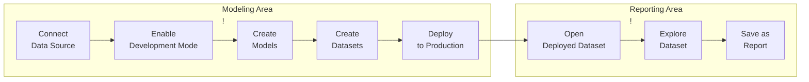

# Holistics modeling worflow 

## Normal workflows

## Getting Started 

### 1. Connect Data Source

The first thing to do is to connect Holistics to your SQL database (usually data warehouse).
If you don't use a SQL database, please refer to [this page](https://docs.holistics.io/docs/connect/dont-have-sql-database) for more information.

There are 2 methods to connect SQL database to Holistics:
* [Direct Connection](https://docs.holistics.io/docs/connect/connect-direct): this is the easiest method as it simply requires you to whitelist Holistics IPs.
* [Reverse SSH Tunnel](https://docs.holistics.io/docs/connect/connect-tunnel): If your database is behind a firewall/closed network you don't want to modify any firewall rules, you can consider setting up a reverse SSH tunnel.

### 2. Enable Development Mode

<video src="https://cdn.holistics.io/docs/as-code/Development-Mode.mp4" controls="controls" muted="muted" class="d-block rounded-bottom-2 border-top width-fit" style="max-width:720px;"></video>

The Development Mode of the project is where you can make changes to the project files without affecting what your end-users are using in Reporting.

### 3. Create Models

A data model is an abstract representation on top of a database table/SQL query that you may manipulate without directly affecting the underlying data.

### 4. Create Datasets

In Holistics, a Dataset is a "container" holding several data models together so they can be explored together, and dictating which join path to be used in a particular analytics use case.

In other words, Dataset is like a mini data mart that enables two things:
* **Data Exploration**: Dataset can be shared to Explorers (non-technical users) to do self-service exploration of the data.
* **Creating Charts**: All Charts in Holistics have to be created from a dataset. This is done either by the Analyst or the Explorer

### 5. Create Relationship

### 6. Deploy to Production

Once you are happy with your changes in Development, you can Deploy to Production and allowing your Business Users to explore and get insights from the Ready-to-use Dataset in the Reporting layer.

## Advanced workflow

### Git integration

With all of analytics logic being described as code using AML, it is natural to be able to check them into a revision control system such as Git.

With Holistics's Git Integration, your Holistics codebase is now powered by Git. You can track every change, perform code branching, change reviews for a better analytics development workflow.

For more information, please refer to our document [here](https://docs.holistics.io/docs/git-version-control) 

### dbt integration

If your team is using dbt and want to automatically pull all of your dbt's metadata to Holistics modeling layer, you can use our [dbt integration](https://docs.holistics.io/docs/dbt-integration).